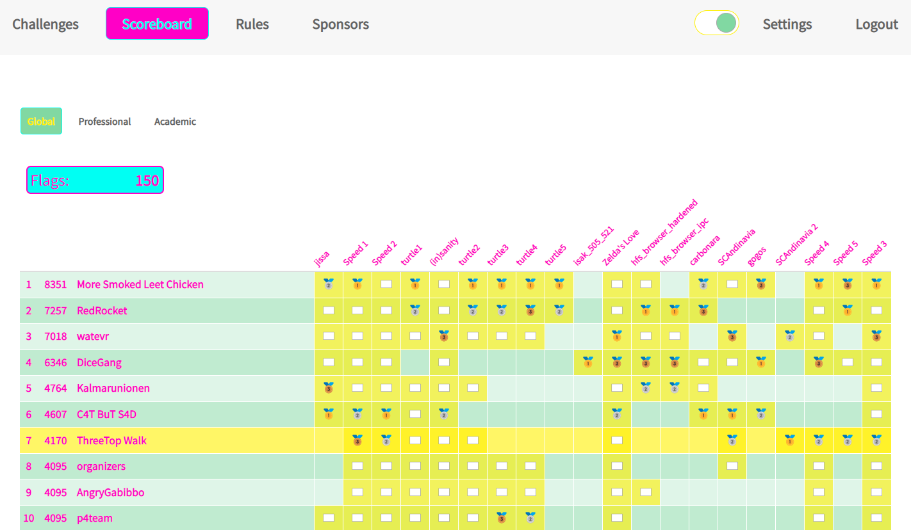

# Midnight Sun CTF 2022 Finals

This was a 24-hour CTF held in Stockholm from 19th-20th August 2022. The top teams from the qualifiers were flown into Sweden to participate in the finals, with all expenses paid! I played with [ThreeTop Walk](https://three.top) and we finished in 7th place, one position lower than the qualifiers.

The crypto challenges were all non-standard, but nonetheless quite enjoyable and of very high quality. I also enjoyed the speed reversing challenges, having not been aware that it was a thing until one minute into the CTF.

The challenges for which I contributed to the solution are:
- [SCAndinavia](SCAndinavia.ipynb) (crypto, 6 solves)
- [SCAndinavia 2](SCAndinavia.ipynb) (crypto, 2 solves)
- Zelda's Love (rev, 13 solves)
- Speed 1 (rev, 13 solves, 3rd place)
- Speed 2 (rev, 13 solves, 2nd place)
- Speed 3 (rev, 13 solves, 2nd place)
- [Speed 5](speed5.ipynb) (rev, 4 solves, 2nd place)

I didn't work on Speed 4 as it was released at 3am and I hadn't quite figured out how to use Energy Gum to stay awake. And I haven't bothered to write up my solution for the other 4 rev challenges, since they were pretty straightforward and all thirteen teams solved them.

It was a bit unfortunate (or maybe intentional?) that Speed 5 took a whole two hours longer than any of the other speed revs. This is because I had to prioritise between that and solving other challenges that might be worth more. Indeed, when the CTF ended, I was only an hour or two away from solving the last remaining crypto challenge. Since I'm a completionist, I went and finished it anyway after the CTF, so here's the write-up:
- [isak_505_521](isak_505_521.ipynb) (crypto, 1 solve -- congrats DiceGang!)
