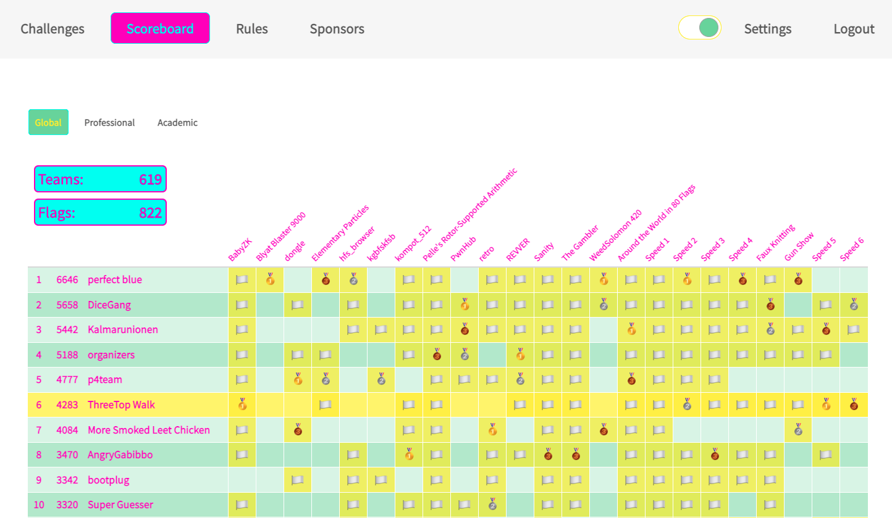

# Midnight Sun CTF 2022 Quals

This was a 24-hour CTF held in early April 2022, with the incentive that top 8 teams get to be flown into Sweden to participate in the finals. I played with [ThreeTop Walk](https://ctftime.org/team/181118) and we managed to make it to 6th place, thus securing a nice holiday in Stockholm.

I enjoyed the crypto and rev challenges, even if I didn't manage to solve WeedSolomon 420. Much thanks to the organisers for this competition, and I look forward to meeting them in the finals.

The challenges for which I contributed to the solution are:
- [BabyZK](BabyZK.ipynb) (crypto)
- [kompot_512](kompot_512.ipynb) (crypto)
- [Pelle's Rotor-Supported Arithmetic](Pelle_RSA.ipynb) (crypto)
- [REVVER](REVVER.ipynb) (rev)
- [The Gambler](gambler.ipynb) (rev)
- [Gun Show](gunshow.md) (misc)
