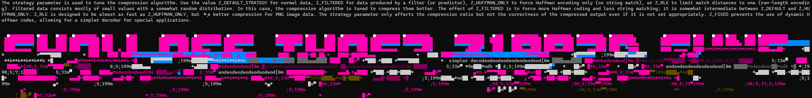

# Gun Show

This challenge is an exercise in hacking a DEFLATE stream. We are a given a random binary (with a `.txt` extension) and nothing else, but a quick inspection shows that it begins with a zlib header. But if we try to decompress it, some tools will spit out an error, while others will just give what looks like truncated text:
```
The strategy parameter is used to tune the compression algorithm. Use the value Z_DEFAULT_STRATEGY for normal data, Z_FILTERED for data produced 
```

We run `infgen` on the binary:
```
! infgen 2.8 output
!
zlib
!
last                    ! 1
fixed                   ! 01
literal 'T              ! 00100001
literal 'h              ! 00011001
literal 'e              ! 10101001
literal '               ! 00001010
<...snip...>
literal 'd              ! 00101001
literal 'u              ! 10100101
literal 'c              ! 11001001
match 3 114             ! 10001 10110 1000000
end                     ! 0000000
!
adler
!
```

This tells us a few things, namely that it was compressed with Z_FIXED, and also that there is in fact an end symbol. However, we are also very early into the stream, so it's possible (likely even) that there is more data after the end symbol. Let's hack infgen a bit to ignore the end symbol.

```
<...snip...>
literal 'd              ! 00101001
literal 'u              ! 10100101
literal 'c              ! 11001001
match 3 114             ! 10001 10110 1000000
end                     ! 0000000
literal 164             ! 001001011
literal 'z              ! 01010101
literal '$              ! 00101010
match 47 41             ! 1000 01010 100 0100100
match 92 797            ! 00011100 11001 1001 0110100
infgen warning: distance too far back (797/195)
match 6 25411           ! 0001101000010 10111 0010000
match 3 30              ! 101 10010 1000000
match 3 115             ! 10010 10110 1000000
literal 'd              ! 00101001
literal 'i              ! 10011001
literal 'c              ! 11001001
literal 't              ! 00100101
<...snip...>
```

It goes for a bit more, but the problem here is that we have an overshoot in `match 6 25411` already, so something is already wrong. However, the "dict" after it looks like real valid literals, so maybe there is some valid code in there. We find a source that provides more of the intended plaintext (`data produced by a filter (or predictor)`) and then compress that with zlib with Z_FIXED to compare. This is what it looks like:
```
<...snip...>
literal 'd              ! 00101001
literal 'u              ! 10100101
literal 'c              ! 11001001
match 3 114             ! 10001 10110 1000000
=========================================================================
literal 'b              ! 01001001
literal 'y              ! 10010101
literal '               ! 00001010
literal 'a              ! 10001001
literal '               ! 00001010
literal 'f              ! 01101001
literal 'i              ! 10011001
literal 'l              ! 00111001
match 4 134             ! 000101 01110 0100000
literal '(              ! 00011010
=========================================================================
match 3 30              ! 101 10010 1000000
match 3 115             ! 10010 10110 1000000
literal 'd              ! 00101001
literal 'i              ! 10011001
literal 'c              ! 11001001
literal 't              ! 00100101
<...snip...>
```
where I've added in the lines to indicate where it differs from the original.

We can attempt to synchronise it with the original to see what goes wrong (note that bits are read right to left):
```
end                     ! 0000000
literal 164             ! 001001] 011
literal 'z              ! 010101][01
literal '$              ! 001010][10
match 47 41             ! 1][000 01010] [100 01001][00
match 92 797            ! 0][0011100 1][1001 1001] [0110100
infgen warning: distance too far back (797/195)
match 6 25411           ! [00011010][00010 10111 0010000
```
and it looks like everything matches up except three stray bits (1,1,0).

At this point, we make the guess that the end block is followed by a bunch of 1s, and then a 0, before proceeding as normal. This seems to work to some extent, and we end up with something that looks guessable.



This is enough to guess that the flag is `midnight{SH0W_0FF_TH0S3_Z1PP3D_GUN5}`.